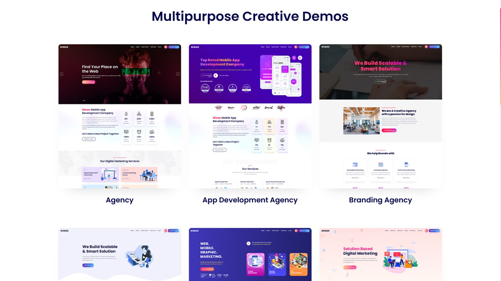
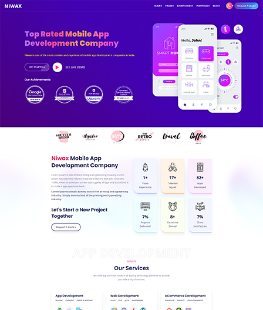
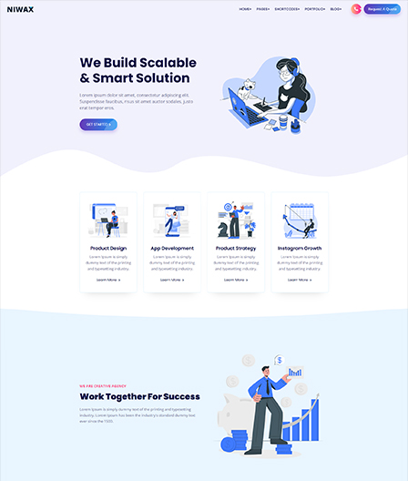

# Multipurpose Demos for Laravel

Welcome to the Multipurpose Demos project.

<p align="center">
  
  
  
  
</p>

## Project Features

-   **Creative Demos**: Explore multiple creative demos including Agency, App Development, Branding, Business Startup, Digital Marketing, Freelance Portfolio, Graphic Studio, Landing Page, Lead Generation, Modern Agency, and Web Design Agency.
-   **Responsive Design**: All demos are designed to be fully responsive and look great on all devices.
-   **Easy Navigation**: Intuitive navigation to quickly access different demo pages.
-   **High-Quality Images**: Each demo includes high-quality images to enhance the visual appeal.
-   **Interactive Elements**: Engage users with interactive elements and smooth animations.

## Technologies Used

-   **Laravel Framework**: A PHP framework for web artisans.
-   **PHP**: The scripting language used for server-side development.
-   **Bootstrap**: A popular CSS framework for developing responsive and mobile-first websites.
-   **Blade**: The simple, yet powerful templating engine provided with Laravel.
-   **JavaScript**: The programming language used for client-side development.
-   **Tailwind CSS**: A utility-first CSS framework for rapid UI development.

## Getting Started

To get started with the Multipurpose Demos project, follow these steps:

1. Clone the repository:

    ```sh
    git clone https://github.com/your-username/multipurpose-demos.git
    ```

2. Navigate to the project directory:

    ```sh
    cd multipurpose-demos
    ```

3. Install the dependencies:

    ```sh
    composer install
    npm install
    ```

4. Set up the environment variables:

    ```sh
    cp .env.example .env
    php artisan key:generate
    ```

5. Run the migrations:

    ```sh
    php artisan migrate
    ```

6. Start the development server:
    ```sh
    php artisan serve
    ```
